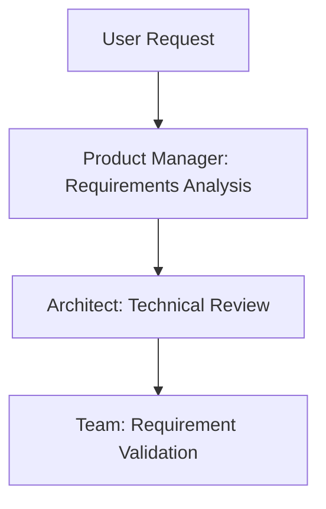
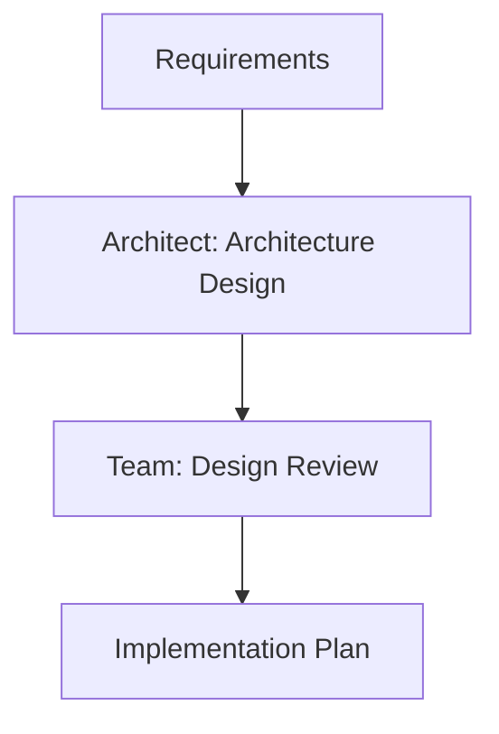
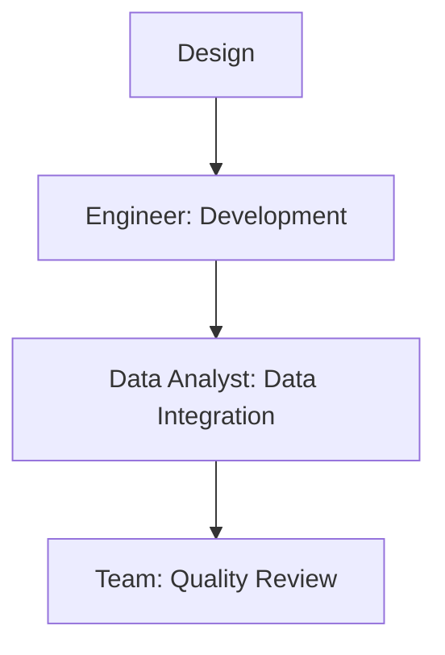

# cursor-agents-rules-dev-team

A powerful AI-driven development team framework that enhances Cursor IDE with AI development team capabilities, providing seamless collaboration between specialized AI agents through Cursor rules for efficient software development.

## 🌟 Features

- **Specialized AI Agents (Implemented as Cursor Rules)**
  - 👨‍💼 **Team Leader**: Coordinates project execution and team communication
  - 👩‍💼 **Product Manager**: Handles requirements and product specifications
  - 👨‍🔧 **Architect**: Designs system architecture and makes technical decisions
  - 👨‍💻 **Engineer**: Implements features and maintains code quality
  - 📊 **Data Analyst**: Manages data processing and analytics

- **Rule-Based Collaboration**
  - Automated team coordination through Cursor rules
  - Seamless handoffs between development phases
  - Context-aware task distribution
  - Integrated quality control

- **Adaptive Rule System**
  - Self-improving rules based on project needs
  - Automatic rule generation from user interactions
  - Dynamic optimization of existing rules
  - Learning from development patterns

- **Standardized Workflows**
  - Requirements gathering and analysis
  - Architecture design and review
  - Implementation and testing
  - Data integration and analytics

## 🚀 Getting Started

### Prerequisites

- Cursor IDE installed
- Git for version control
- Basic understanding of Cursor rules

### Setting

> 💡 **IDE Setting HIGHLY Suggested:** For best results with rule generation, update your Cursor settings by adding:
>
> ```json
> "workbench.editorAssociations": {
>   "*.mdc": "default"
> }
> ```

This prevents UI rendering issues with .mdc files in a custom rules form and ensures proper save functionality, and makes it easier to see what the actual rules look like (specifically around hidden FrontMatter).

### Installation

1. Clone the repository:
```bash
git clone https://github.com/Airmomo/cursor-agents-rules-dev-team.git
cd cursor-agents-rules-dev-team
```

## 📋 Usage

### Creating a New Project with AI Dev.Team Rules

1. **Initialize Project Structure**
```bash
# Clone the Cursor2DevTeam repository
git clone https://github.com/Airmomo/cursor-agents-rules-dev-team.git

# Create your new project directory
mkdir my-new-project
cd my-new-project

# Copy the team rules
cp -r ../cursor-agents-rules-dev-team/.cursor .
```

2. **Configure Project Settings**
- Update project name and details in your new project's README.md
- Customize team rules if needed in `.cursor/rules/`
- Initialize git repository:
```bash
git init
git add .
git commit -m "Initialize project with AI Dev.Team rules"
```

3. **Start Development**
- Open project in Cursor IDE
- Begin interaction with team by mentioning requirements
- Team agents will automatically coordinate based on rules

### Applying AI Dev.Team Rules to Existing Project

1. **Integrate Team Rules**
```bash
# Navigate to your existing project
cd your-existing-project

# Clone Cursor2DevTeam repository
git clone https://github.com/Airmomo/cursor-agents-rules-dev-team.git temp-dev-team

# Copy team rules (preserving your existing files)
cp -r temp-dev-team/.cursor .

# Clean up
rm -rf temp-dev-team
```

2. **Adapt Existing Structure**
- Review and merge any existing rules in `.cursor/rules/`
- Ensure no conflicts with existing project configuration
- Update team rules if needed for project-specific requirements

3. **Commit Changes**
```bash
git add .cursor
git commit -m "Integrate AI Dev.Team rules"
```

4. **Start Using Team**
- Open project in Cursor IDE
- Team agents will automatically analyze existing codebase
- Begin interaction with team for new features or modifications

### Best Practices for Team Usage

1. **Clear Communication**
- Simply state your requirements or questions directly
- Be specific about what you want to achieve
- Provide necessary context for existing code when relevant
- The AI team will automatically understand and coordinate the response

2. **Project Organization**
- Keep team rules in `.cursor/rules/` updated
- Document any customizations to team behavior
- Maintain consistent project structure

3. **Workflow Integration**
- Let the AI team naturally handle task distribution
- Allow agents to collaborate automatically based on your needs
- Review and approve suggested changes

## 🤝 Team Collaboration

### Development Phases

1. **Requirements Phase**


2. **Architecture Phase**


3. **Implementation Phase**


## 🤖 Agent Rules

### Team Leader Rule
- Project coordination
- Team communication
- Progress tracking
- Quality assurance

### Product Manager Rule
- Requirements gathering
- Product specification
- Feature prioritization
- User story creation

### Architect Rule
- System design
- Technical decisions
- Architecture documentation
- Technology selection

### Engineer Rule
- Code implementation
- Testing
- Performance optimization
- Technical documentation

### Data Analyst Rule
- Data modeling
- Analytics implementation
- Visualization
- Data pipeline design

### Team Collaboration Rule
- Inter-agent communication
- Workflow coordination
- Quality control
- Progress tracking

### Rule Generator
- Automated rule creation from user interactions
- Rule optimization based on project patterns
- Context-aware rule suggestions
- Learning from development workflows

## 🧠 Adaptive Learning System

The cursor-agents-rules-dev-team framework features a sophisticated adaptive learning system that continuously improves its capabilities:

### Automatic Rule Generation
- The system can automatically create new rules based on your development patterns
- When you encounter repetitive tasks or workflows, the system can propose creating specialized rules
- Custom rules are created through the rule-generating-agent that formalizes your preferences

### Rule Optimization
- Existing rules are continuously refined based on their effectiveness
- The system analyzes which rules are most helpful and adjusts accordingly
- Rules can be automatically updated to better match your development style

### Context-Aware Learning
- The system recognizes different development contexts and applies appropriate rules
- As your project evolves, the rule system evolves with it
- Domain-specific knowledge is accumulated and incorporated into appropriate rules

### User Interaction
- Simply mention that you'd like to create or modify rules during your workflow
- The system can learn from your corrections and adjustments
- Express preferences about agent behavior, and they'll be incorporated into future interactions

---
Built with ❤️ using Cursor IDE with AI Development Team
